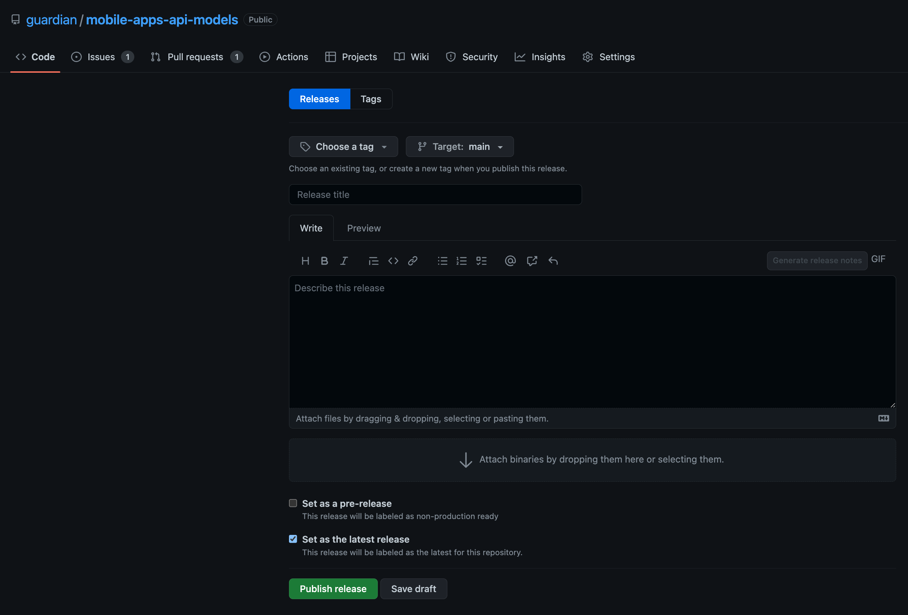
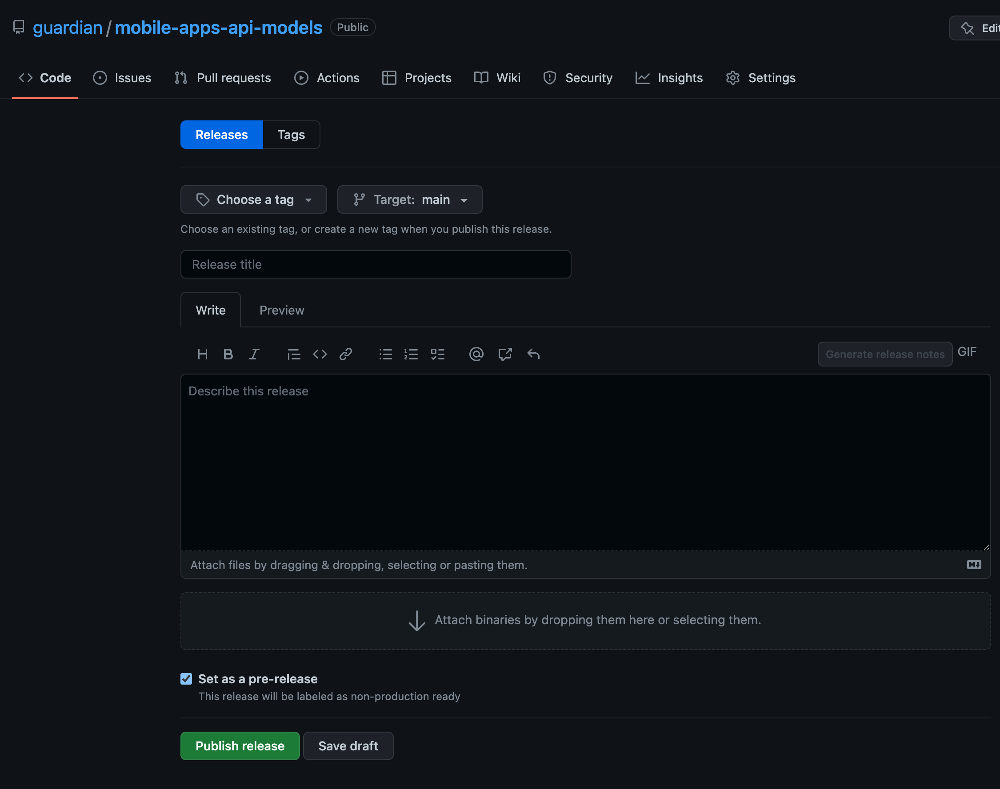

[](https://index.scala-lang.org/guardian/mobile-apps-api-models/mobile-apps-api-models)

# Mobile Apps Api Models

These models are used to communicate between MAPI and the native apps.
This repository defines the protobuf [schema](proto/v0/collection.proto) for "blueprint" collections.

## Validating Schema Changes

We use [protolock](https://github.com/nilslice/protolock) to help us catch any unintentional breaking changes.
In the proto directory a `proto.lock` file exists which captures a verbose state of the latest version of the proto file.
When making changes to the proto file a [check](.github/workflows/version-compatibility.yml) will run on the PR to validate that [rules](https://github.com/nilslice/protolock) are enforced.
The enforcement of rules helps to make sure that we don't accidentally introduce breaking changes.

PRs will fail if there are any updates in the proto file that aren't recorded in the proto.lock. In order to update the lock file:
- [Install](https://github.com/nilslice/protolock#install) protolock.
- In the root of this repository run `protolock status --uptodate --protoroot ./proto/ -lockdir ./proto/ ` --> this will log any changes between the latest and locked proto file.
- If there are non-breaking changes you wish to commit, then run: `protolock commit --protoroot ./proto/ -lockdir ./proto/` --> this will update the lock file with the latest changes.
- We should commit _both_ the changes to the proto file and the proto.lock file.

If the protolock `status` command reveals breaking changes:
- Check if we can introduce the same changes in a non-breaking way.
- If we want to make a breaking change to the proto file this would require coordination between MAPI and native clients.
- If we want to commit and release a new major version of the proto file we can do this by running the command: `protolock commit --protoroot ./proto/ -lockdir ./proto/ --force`

## Linting

[Protolint](https://github.com/yoheimuta/protolint) is used to lint the proto files in this repository.
Protolint follows the official Google [style guide](https://protobuf.dev/programming-guides/style/).

If the proto file isn't linted correctly status checks on a PR will fail.

To fix any lint errors:

```
brew install protolint
protolint -fix ./proto/.
```

## Releases

Use the GitHub UI to generate schema releases.

For Scala, the release process results in a deployment to [Maven](https://repo1.maven.org/maven2/com/gu/mobile-apps-api-models_2.12/).
For android and iOS, the corresponding models will be generated by separate processes (e.g. at build time).

To release via the GitHub UI, visit [this](https://github.com/guardian/mobile-apps-api-models/releases/new) page.
- Create a tag version in the format vX.X.X that represents the version you'd like to release.
  The tag will be created as part of the process so doesn't need to exist before creating a release.
- Define a release title and any useful release notes.
- Ensure the box "Set as pre-release" is _**not**_ checked and the checkbox "Set as the latest release" _**is**_ checked.
- When clicking the "Publish release" button a GitHub workflow will be triggered to generate and publish the Scala models.



## Non-production releases

### Scala

A snapshot (pre-release) version can be released via the GitHub UI.

The steps you should take are:
- Push the branch with the changes you want to release to GitHub.
- [Click here](https://github.com/guardian/mobile-apps-api-models/releases/new?prerelease=true) to create prerelease using GitHub releases. 
You should see a view like this:



You must then:
- Set the Target to your branch.
- Create a tag for the snapshot release (the tag will be created as part of the pre-release if it doesn't already exist).
- The tag should ideally have format "vX.X.X-SNAPSHOT" (the workflow will account for a missing `v` or `-SNAPSHOT`).
- Double-check that the "Set as pre-release" box is ticket.
- To automatically release the snapshot to sonatype, click the "Publish release" button.
- You should be able to find the snapshot release [here](https://oss.sonatype.org/content/repositories/snapshots/com/gu/)