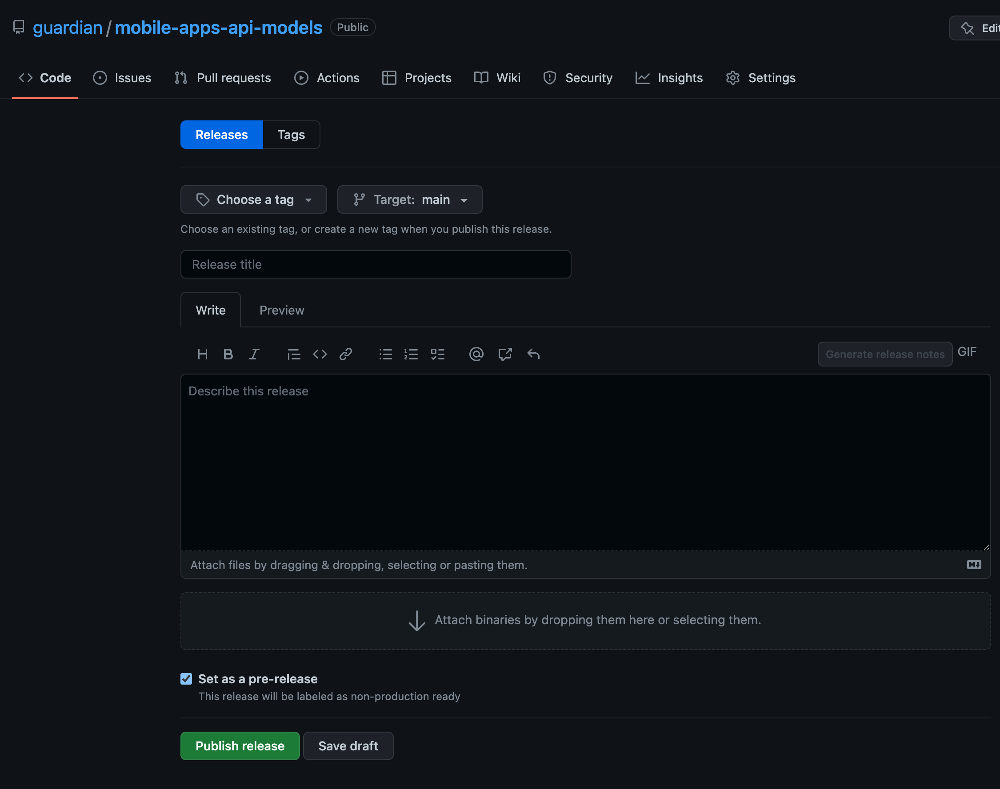

# Mobile Apps Api Models

These models are used to communicate between MAPI and the native apps.

## Non-production releases

### Scala

A snapshot version can be released via the github UI.

The steps you should take are:
- Push the branch with the changes you want to release to Github.
- [Click here](https://github.com/guardian/mobile-apps-api-models/releases/new?prerelease=true) to create prerelease using Github releases. You should see a view like this:

You must then:
- Set the Target to your branch.
- Create a tag for the snapshot release (the tag will be created as part of the pre-release if it doesn't already exist).
- The tag should ideally have format "vX.X.X-SNAPSHOT" (the workflow will account for a missing `v` or `-SNAPSHOT`).
- Double-check that the "Set as pre-release" box is ticket.
- To automatically release the snapshot to sonatype, click the "Publish release" button.
- You should be able to find the snapshot release [here](https://oss.sonatype.org/content/repositories/snapshots/com/gu/)