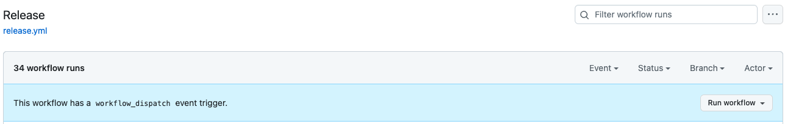

[](https://index.scala-lang.org/guardian/mobile-apps-api-models/mobile-apps-api-models)

# Mobile Apps Api Models [](https://github.com/guardian/mobile-apps-api-models/actions/workflows/release.yml)

These models are used to communicate between MAPI and the native apps.
This repository defines the protobuf [schema](./proto/collection.proto) for "blueprint" collections.

## Versioning

We should aim to _grow_ the Blueprint schema (e.g. adding new fields) rather than breaking it (removing fields or 
changing their type).

When it becomes advantageous or desirable to introduce a _breaking_ change to the schema we should do this in 
collaboration with both server and native teams.

When a new major version of the Blueprint schema is released, the Blueprint model will have a new package namespace and
a new artifact name. There will also be associated server and native changes as a result of this.

See the [documentation](https://github.com/guardian/mobile-apps-api/tree/main/doc/versioning-of-blueprint-endpoints.md) in MAPI for full details of the versioning considerations, proposal and process.

## Validating Schema Changes

We use [protolock](https://github.com/nilslice/protolock) to help us catch any unintentional breaking changes.
In the proto directory a `proto.lock` file exists which captures a verbose state of the latest version of the proto file.
When making changes to the proto file a [check](.github/workflows/version-compatibility.yml) will run on the PR to validate that [rules](https://github.com/nilslice/protolock) are enforced.
The enforcement of rules helps to make sure that we don't accidentally introduce breaking changes.

PRs will fail if there are any updates in the proto file that aren't recorded in the proto.lock. In order to update the lock file:
- [Install](https://github.com/nilslice/protolock#install) protolock.
- In the root of this repository run `protolock status --uptodate --protoroot ./proto/ -lockdir ./proto/ ` --> this will log any changes between the latest and locked proto file.
- If there are non-breaking changes you wish to commit, then run: `protolock commit --protoroot ./proto/ -lockdir ./proto/` --> this will update the lock file with the latest changes.
- We should commit _both_ the changes to the proto file and the proto.lock file.

If the protolock `status` command reveals breaking changes:
- Check if we can introduce the same changes in a non-breaking way.
- If we want to make a breaking change to the proto file this would require coordination between MAPI and native clients.
- If we want to commit and release a new major version of the proto file we can do this by running the command: `protolock commit --protoroot ./proto/ -lockdir ./proto/ --force`

### Troubleshooting protolock

If you've successfully installed protolock, but are getting a `zsh: command not found: protolock` error when running commands, try adding the following to your ~/.zshrc file:
```
export GOPATH="$HOME/go"
export GOBIN="$GOPATH/bin"
export PATH="$GOBIN:$PATH"
```

## Linting

[Protolint](https://github.com/yoheimuta/protolint) is used to lint the proto files in this repository.
Protolint follows the official Google [style guide](https://protobuf.dev/programming-guides/style/).

If the proto file isn't linted correctly status checks on a PR will fail.

To fix any lint errors:

```
brew install protolint
protolint -fix ./proto/.
```

## Releases

Releases of this library to Maven are handled using The Guardian's [GHA Scala Library Release Workflow](https://github.com/guardian/gha-scala-library-release-workflow)
which manages the various stages of publishing Scala libraries. See that repo for further information about the process
and configuration.

We can trigger the release workflow via the `Actions` tab of the repo, selecting the `Release` workflow and then `Run workflow`:


The release version will be determined by version.sbt, which allows the developer to control exactly what version
should be released. This is important for this repo because of the [agreement already in place about how major version
changes will be handled](https://github.com/guardian/mobile-apps-api/blob/main/doc/versioning-of-blueprint-endpoints.md).

Part of the release process includes committing the next version to version.sbt meaning a result of the release process
will be a commit to `main` with the next intended release version (this will include the `-SNAPSHOT` suffix). If we wish
for a different version to be released (e.g. a major or patch version increment) then we should update version.sbt before
running the release workflow.

## Non-production releases

The GHA doesn't [yet](https://github.com/guardian/gha-scala-library-release-workflow/issues/10) support snapshot releases.
We can test changes locally using the sbt command `publishLocal` but will not be able to e.g. deploy an instance of MAPI
to CODE that references the local changes to mobile-apps-api-models. 
